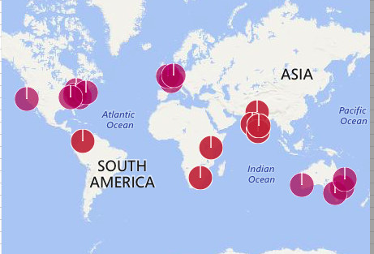
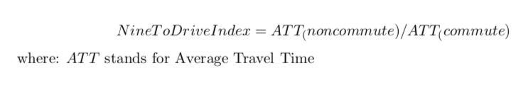
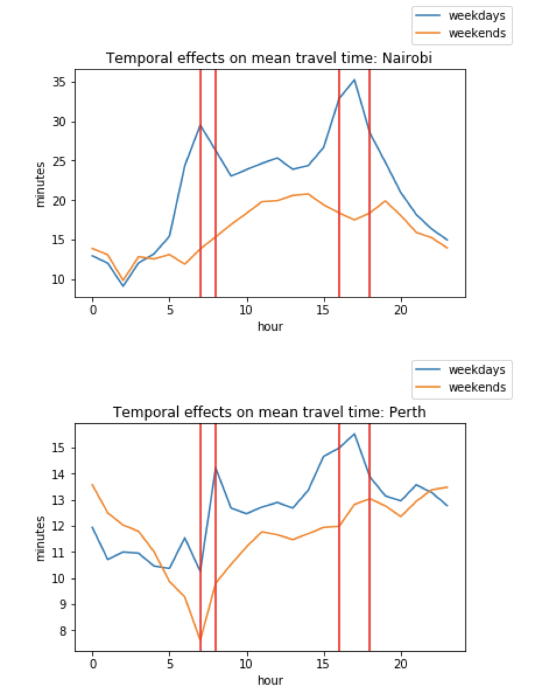
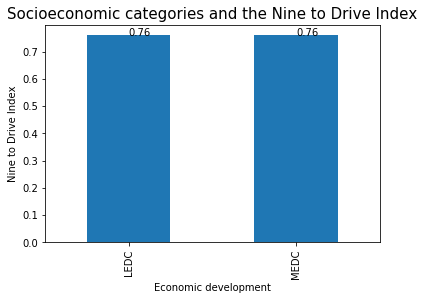

### MACS 30200 (Spring 2018) - Perspectives on Computational Research: Term Paper

# "Working Nine to Drive": Socioeconomic Status and Commuter Traffic

### Laurence Warner, MA Computational Social Science, University of Chicago, lpwarner@uchicago.edu

# Abstract

The ‘9 to 5’ is a Western capitalist convention of working hours for white collar workers. The need to travel to work means that conventional wisdom states that travel times will be longer before and after 9 and 5 respectively. In order to investigate this hypothesis empirically, we use newly available observational data. We define a novel index to demonstrate that this is indeed the case. Conventional wisdom also suggests that the effect should be less pronounced in cities in lower socioeconomic status countries, due to lower levels of white collar workers. However, our data and method does not provide empirical support for this hypothesis. 

# Introduction

The ‘9 to 5’ is a Western capitalist convention of working hours. Sociologists describe those who work in tertiary industries which usually follow such rigid patterns 'white collar' workers.

Conventional wisdom states that white collar commuters heavily influence traffic patterns. In this paper we will investigate this empirically.

*Hypothesis 1: Journey times increase during commuter hours.*

Less Economically Developed Countries (LEDCs) have a lower % of white collar workers.

*Hypothesis 2: Traffic in generally non-western LEDCs is not as heavily dictated by commuting hours.*

# Data

Uber Movement is a service providing anonymized data to the public on over 2 billion trips to help urban planners and the public better understand traffic patterns.

The following shows an example of the data that exists. It is semi-aggregated: it shows the average travel time between different city zones.

The first novel contribution of this paper is the use of newly available observational data.

In April 2018, Uber expanded its program to 20 cities, 7 of which are from Less Economically Developed Countries (LEDCs), giving unique insight into traffic patterns in those countries.

This is big data: I download around 5GB worth of data in CSV format in order to use millions of rides to answer my research question. I narrow my focus to the first quarter of 2016, in order to have data available on all cities (except Cairo which is excluded for missingness). The following visualization shows how I divide the 19 cities into MEDCs in purple and LEDCs in red:

# Literature Review

## Commuting

I am inspired by Walters (1961), which conceptualises traffic as a public bad which is overconsumed due to the negative externality imposed upon other drivers, as the first paper framing the socioeconomic determinants of traffic.

Bazzan et al. (1999) built upon this work to incorporate temporal variation by conducting agent-based simulation considering temporal incentives on traffic. Our paper seeks to validate the predictions of models like this in hypothesis 1 empirically.

Kilpeläinen et al. (2007) used a survey of drivers to analyze how weather and weather forecasts affect driving behavior. I am inspired by the investigation of temporal variation in traffic, but I would argue that directly observing observation data is a superior approach than unreliable and potentially biased survey data.

## Ride-service data

One of the first papers to analyze large-scale data on taxi movement was Zheng et al.(2011). They analyzed 30,000 taxicabs in Beijing.
Uber Movement will allow me to scale up this analysis.

The only existing paper to use Uber Movement is Pearson et al. (2015).  I will build upon the work, by undertaking work suggested in 'Section 6: Future Work'. The authors recommend the use of temporal analysis to compare traffic flows at different times.

Some papers conduct more in depth analysis of a city, diving into the structure of the city. For example, Liu (2015) sets up a methodology of analysing the structure of a city. They convert the city of Shanghai into a graph to allow for network analysis. An extension to this paper would be to conduct more in depth spatial analyses within cities. However, for the sake of parsimony, we aggregate spatial information on cities.

# Methods

## Index
There does not currently exist a single quantitative measure of the effect of commuter travel times. The major novel contribution of this paper is the proposal of a quantitative index, which we coin the "Nine to Drive Index".

ATT is calculated as the average travel time of all rides in a city during a given time period. In this analysis, we define weekday commute hours as those which were the maximum for some city:
* Weekday AM; 7, 8
* Weekday PM: 16, 17, 18

These times are also theoretically sound, as they fall intuitively in relation to Nine & Five. Non-commute hours are defined as the complement of that set.

The index should be interpreted as follows. The support of the index is the set (0,1). 1 corresponds to no commuter effect. The lower the index, the higher the spike in commuter hours and therefore a higher commuter temporal effect.

We can reinterpret the hypotheses in the context of the Index as follows:

*Hypothesis 1: Cities will have a Five to Nine Index below 1*

Less Economically Developed Countries (LEDCs) have a lower % of white collar workers.

*Hypothesis 2: LEDCs will have a higher Five to Nine Index*

We make the assumption that average travel distance remains constant between commute and non-commute times. This is not possible to empirically validate given the dataset.

## Example

Below are examples of the data for the most extreme cities in our data set. Nine To Drive hours are bounded by the red lines.

When indices are calculted, Nairobi has the most significant Nine To Drive Index: 0.614, whereas Perth has the least significant: 0.871.

# Results

We calculate Nine to Drive Indices for all 19 cities. The key result which sheds light upon both hypothesis is demonstrated in this beautifully simple visualization.

## Hypothesis 1

There is a clear commuter effect, with an average Nine to Drive index across the board of 0.76. This can be interpreted as saying that commuter hours add on average 1/3 to travel times, and up to 1/2 (in the case of Nairobi). This is a hugely significant effect. This result supports conventional wisdom and is useful knowledge for everyday life.

## Hypothesis 2

There is not a statistically significant difference between the average Nine to Drive Index of the MEDCs and LEDCs. Hence, there is not support for hypothesis 2.

The fact that the indices are identical is superfluous, but does make for quite a satisfying challenge to conventional wisdom.

# Conclusion and Future Work

This study represents an initial response to newly available observational data. The rejection of hypothesis 2 is a surprising result that I hope can be investigated further.

In terms of building upon this research, I hope that Uber will continue to expand the amount of data available in Movement. One weakness of this study is the scarcity of data on LEDCs. They are dominated by Indian cities, and Nairobi is a skewing outlier. I hope that Uber will continue to publish more data on LEDCs, enabling researchers to be more confident in rejecting the conventional wisdom of hypothesis 2.

The main avenue to expand upon this research is to spatially disaggregate the data. Firstly, trying to hold travel distance constant would be a good start. Secondly, considering the economic makeup of different spatial zones would help shed further light on the causality behind the Nine to Drive effect.

# References

Bazzan, Ana Lécia C., Joachim Wahle, and Franziska Klügl. "Agents in traffic modelling—from reactive to social behaviour." In Annual Conference on Artificial Intelligence, pp. 303-306. Springer, Berlin, Heidelberg, 1999.

Kilpeläinen, Markku, and Heikki Summala. "Effects of weather and weather forecasts on driver behaviour." Transportation research part F: traffic psychology and behaviour 10, no. 4 (2007): 288-299.

Liu, Xi, Li Gong, Yongxi Gong, and Yu Liu. "Revealing travel patterns and city structure with taxi trip data." Journal of Transport Geography 43 (2015): 78-90.

Pearson, Mackenzie, Javier Sagastuy, and Sofıa Samaniego. "Traffic Flow Analysis Using Uber Movement Data." Palo Alto, CA: Stanford University), available at http://web.stanford.edu/class/cs224w/projects/cs224w-11-final.pdf (last accessed March 2018).

Walters, Alan A. "The theory and measurement of private and social cost of highway congestion." Econometrica: Journal of the Econometric Society (1961): 676-699.

Zheng, Yu, Yanchi Liu, Jing Yuan, and Xing Xie. "Urban computing with taxicabs." In Proceedings of the 13th international conference on Ubiquitous computing, pp. 89-98. ACM, 2011.
