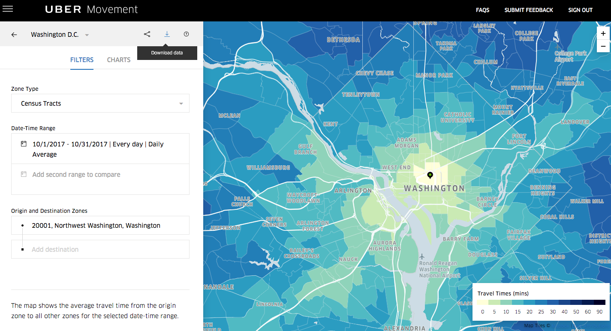

# MACS 30200 (Spring 2018) - Perspectives on Computational Research
## Term Paper

# "Working Nine to Drive" : Socioeconomic Status and Commuter Traffic

## MA Computational Social Science, University of Chicago, lpwarner@uchicago.edu

# Abstract

# Introduction

The ‘9 to 5’ is a Western capitalist convention of working hours. Sociologists describe those who work in tertiary industries which usually follow such rigid patterns 'white collar' workers.

Conventional wisdom states that white collar commuters heavily influence traffic patterns. In this paper we will investigate this empirically.

*Hypothesis 1: Journey times increase during commuter hours.*

Less Economically Developed Countries (LEDCs) have a lower % of white collar workers.

*Hypothesis 2: Traffic in generally non-western LEDCs is not as heavily dictated by commuting hours.*

# Data

The most exciting contribution of this paper is the use of newly available observational data.

Uber Movement is a service providing anonymized data to the public on over 2 billion trips to help urban planners and the public better understand traffic patterns.

In April 2018, Uber expanded its program to 20 cities, 7 of which are from Less Economically Developed Countries (LEDCs), giving unique insight into traffic patterns in those countries.

I download around 5GB worth of data in CSV format in order to answer my research question.

# Literature Review

One of the first papers to analyse large-scale data on taxi movement was Zheng et al.(2011). They analyzed 30,000 taxicabs in Beijing.
Uber Movement will allow me to scale up this analysis.

# Methods

# Results

# Conclusion

# References

Zheng, Yu, Yanchi Liu, Jing Yuan, and Xing Xie. "Urban computing with taxicabs." In Proceedings of the 13th international conference on Ubiquitous computing, pp. 89-98. ACM, 2011.
